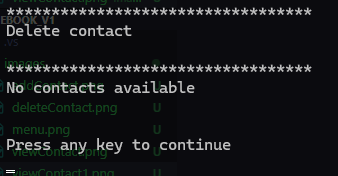

# Basic Telephone Directory in C++

This is a simple exercise on a simple contact book written in C++.

Allows you to view, add and delete contacts. Each contact has a first name, last name, phone number, address (city, state, and zip code), and date of birth.

## Compilation and Execution

### Requirements

- A C++ compiler (such as `gcc`, `clang`, or the Visual Studio compiler).
- Windows operating system (due to the use of the `conio.h` and `system("cls")` library).

### Compilation

To compile the program, use a supported C++ compiler. Here is an example using `g++`:

```sh
g++ -o phonebook phonebook.cpp
```

## Screen images

### Menu


### Add Contact


### View contact

#### With contacts

#### No contacts


### Delete contacts
#### With contacts

#### No contacts
